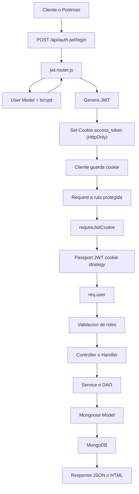

# Backend 77080

Backend API con `Express + MongoDB (Mongoose)` para prácticas de Backend, con varios enfoques de autenticación y una parte MVC con vistas `Handlebars` para órdenes.

## Qué incluye hoy

- CRUD de estudiantes (`/student`) sin auth (ruta clásica directa).
- CRUD de estudiantes protegido (`/new-student`) con `Controller + Service + DTO`.
- Auth por sesión tradicional (`/auth/*`).
- Auth con `Passport Local + Session` (`/api/auth/*`).
- Auth JWT Bearer (`/api/auth/jwt/*`).
- Auth JWT en cookie HttpOnly con `passport-jwt` (`/api/auth-jwt/*`).
- Módulo de órdenes con API REST + vista HTML (`/api/orders`, `/orders`).
- Rutas avanzadas con `CustomRouter`, `group`, `param preload` y manejo async.
- Diagnóstico de proceso (`/process`).

## Stack y arquitectura

### Stack

- Node.js + Express 5
- MongoDB + Mongoose 9
- `express-session` + `connect-mongo` (sesiones persistidas en Mongo)
- `passport` (`local`, `jwt`, `github2`)
- `jsonwebtoken`
- `bcrypt`
- `express-handlebars`

### Arquitectura actual (conviven dos estilos)

1. Estilo clásico (directo)
- `Router -> Model (Mongoose)`
- Usado en rutas como `/student` y parte de auth.

2. Estilo por capas (modular)
- `Router -> Controller -> Service -> DAO -> Model`
- Usado en `orders` y `new-student` (este último sin DAO, pero sí controller/service/DTO).

3. Infraestructura transversal
- `middleware/logger` para trazas de inicio/fin por request.
- `middleware/auth` para sesión, JWT Bearer y JWT-cookie.
- `middleware/polices` para autorización por roles usando `req.user`.
- `passport.config` para strategies `local` y `jwt-cookie`.
- `server.app` para bootstrap (env, DB, session store, passport, handlebars, routers).

## Flujo (Mermaid)

Nota: este flujo está implementado para rutas como `/api/auth-jwt/me` y `/new-student/*`.
No aplica al módulo `orders` mientras `router.use(requireJwtCookie)` siga comentado en `src/router/routes/order.router.js`.



Si no se visualiza el diagrama, tu visor Markdown probablemente no soporta Mermaid. En GitHub web suele verse correctamente.

Flujo equivalente en texto:

```text
Cliente -> POST /api/auth-jwt/login
       -> jwt.router -> User + bcrypt -> JWT
       -> Set-Cookie(access_token)
       -> Request a ruta protegida
       -> requireJwtCookie (passport-jwt)
       -> req.user
       -> validación de roles
       -> controller/handler -> service/dao -> model -> MongoDB
       -> response
```

## Estructura actual del proyecto

Arbol resumido (omitidos `node_modules` para legibilidad):

```text
BE_2_77080/
|-- app.js
|-- package.json
|-- package-lock.json
|-- .env.example
|-- README.md
`-- src/
    |-- config/
    |   |-- auth/
    |   |   `-- passport.config.js
    |   |-- db/
    |   |   `-- connect.config.js
    |   `-- env/
    |       `-- env.config.js
    |-- controllers/
    |   |-- order.controller.js
    |   `-- student.controller.js
    |-- dao/
    |   |-- base.dao.js
    |   `-- order.mongo.dao.js
    |-- middleware/
    |   |-- auth.middleware.js
    |   |-- logger.middleware.js
    |   `-- polices.middleware.js
    |-- models/
    |   |-- order.model.js
    |   |-- student.model.js
    |   |-- user.model.js
    |   `-- dto/
    |       `-- student.dto.js
    |-- postman/
    |   |-- Advanced.postman_collection.json
    |   |-- Auth.postman_collection.json
    |   |-- JWT Auth.postman_collection.json
    |   |-- Process.postman_collection.json
    |   |-- Session Auth.postman_collection.json
    |   `-- Students.postman_collection.json
    |-- router/
    |   |-- router.js
    |   |-- custom/
    |   |   `-- CustomRouter.js
    |   `-- routes/
    |       |-- advanced.router.js
    |       |-- api.v1.router.js
    |       |-- auth.router.js
    |       |-- home.router.js
    |       |-- jwt.router.js
    |       |-- new.student.router.js
    |       |-- order.router.js
    |       |-- process.router.js
    |       |-- profile.router.js
    |       |-- student.router.js
    |       `-- user.router.js
    |-- server/
    |   |-- hbs.helper.js
    |   `-- server.app.js
    |-- services/
    |   |-- order.service.js
    |   `-- student.service.js
    `-- views/
        |-- layouts/
        |   `-- main.handlebars
        `-- orders/
            `-- index.handlebars
```

## Bootstrap y arranque

`app.js` inicia `startServer()` y el bootstrap hace:

1. Carga/valida variables de entorno (`validateEnv`).
2. Conecta a Mongo (`LOCAL` o `ATLAS` según `MONGO_TARGET`).
3. Configura `express-session` con `MongoStore`.
4. Inicializa `passport` (`local`, `jwt-cookie`, serialize/deserialize).
5. Configura `cookie-parser` + `express.json()`.
6. Registra `logger` global.
7. Configura motor `Handlebars`.
8. Monta routers.
9. Inicia `listen(PORT)`.

## Variables de entorno

Crear `.env` desde `.env.example`.

PowerShell:

```powershell
Copy-Item .env.example .env
```

Variables soportadas:

| Variable | Requerida | Descripción |
|---|---|---|
| `NODE_ENV` | No | Entorno (`development`, `production`, etc.). |
| `PORT` | No | Puerto del server. En código default `5000`; `.env.example` trae `8000`. |
| `MONGO_TARGET` | No | `LOCAL` o `ATLAS`. |
| `MONGO_URL` | Sí si `MONGO_TARGET=LOCAL` | URI Mongo local. |
| `MONGO_ATLAS_URL` | Sí si `MONGO_TARGET=ATLAS` | URI Mongo Atlas. |
| `SECRET_SESSION` | Sí | Secreto de sesión y firmado de cookies. |
| `JWT_SECRET` | Sí | Secreto para firmar/verificar JWT. |
| `GITHUB_CLIENT_ID` | Opcional | Solo si habilitas OAuth GitHub. |
| `GITHUB_CLIENT_SECRET` | Opcional | Solo si habilitas OAuth GitHub. |
| `GITHUB_CALLBACK_URL` | Opcional | Callback OAuth GitHub. |

## Instalación y ejecución

```bash
npm install
npm run dev
```

Scripts:

- `npm run dev`: inicia con `nodemon`
- `npm start`: inicia con `node app.js`
- `npm test`: placeholder

## Funcionalidades por módulo

### 1) Home

- `GET /` devuelve mensaje simple de bienvenida JSON.

### 2) Students clásico (`/student`)

CRUD directo contra `Student` (sin capa service/controller):

- `GET /student`
- `POST /student`
- `GET /student/:id`
- `PUT /student/:id`
- `DELETE /student/:id`

Incluye:

- validación de ObjectId en `:id`
- control básico de duplicado por `email`

### 3) Session auth básico (`/auth`)

Rutas sobre `user.router.js` usando `req.session.user`:

- `POST /auth/register`
- `POST /auth/login`
- `POST /auth/logout`
- `GET /auth` (lista usuarios, requiere sesión)

Y perfil:

- `GET /auth/me` (montado desde `profile.router.js`)

### 4) Auth avanzada (`/api/auth`)

Usa `Passport Local + Session`, más JWT Bearer en subrutas:

- `POST /api/auth/register`
- `POST /api/auth/login` (passport local + `req.logIn`)
- `POST /api/auth/logout`
- `GET /api/auth/me`
- `POST /api/auth/jwt/login` (retorna token en JSON)
- `GET /api/auth/jwt/me` (requiere `Authorization: Bearer <token>`)

También expone endpoints GitHub OAuth (strategy actualmente comentada en config):

- `GET /api/auth/github`
- `GET /api/auth/github/callback`
- `GET /api/auth/github/fail`

### 5) JWT en cookie HttpOnly (`/api/auth-jwt`)

Flujo moderno usando `passport-jwt` leyendo cookie `access_token`:

- `POST /api/auth-jwt/register`
- `POST /api/auth-jwt/login` (setea cookie `access_token`)
- `GET /api/auth-jwt/me` (requiere cookie + role `user|admin`)
- `POST /api/auth-jwt/logout` (limpia cookie)

### 6) Students con Controller/Service (`/new-student`)

Protegido globalmente por `requireJwtCookie`:

- `GET /new-student/` (autenticado)
- `GET /new-student/:id` (`admin|user`)
- `POST /new-student/` (`admin`)
- `PUT /new-student/:id` (`admin`)
- `DELETE /new-student/:id` (`admin`)

Patrón aplicado:

- Router -> Controller -> Service -> Model
- DTO para create/update (`student.dto.js`)

### 7) Orders (API + vista Handlebars)

Incluye módulo con `Controller + Service + DAO + Model` y vista:

- `GET /orders` -> vista HTML `Handlebars` con paginación y filtro por estado
- `GET /api/orders` -> lista paginada JSON (`page`, `limit`, `status`)
- `GET /api/orders/:id`
- `GET /api/orders/:code`
- `POST /api/orders/`
- `PUT /api/orders/:id`
- `DELETE /api/orders/:id`
- `POST /api/orders/seed` -> inserta datos de ejemplo si la colección está vacía

Características del módulo:

- `OrderMongoDAO` con `listPaginated()`
- cálculo automático de `total` en hooks de Mongoose (`pre("validate")` y `pre("findOneAndUpdate")`)
- vista `orders/index.handlebars` con helpers (`formatMoney`, `formatDate`, `range`, `eq`)

### 8) Advanced (`/advanced`)

Demostración de router custom y composición:

- `GET /advanced/students/:id` (preload por params + auth JWT cookie + roles)
- `GET /advanced/students/:id/courses` (subrouter con `mergeParams`)
- `GET /advanced/v1/ping`
- `GET /advanced/boom` (lanza error async de prueba)

### 9) API versionada (`/api/v1`)

Subrouter que reexpone:

- `/api/v1/` (home)
- `/api/v1/student/*` (CRUD students clásico)
- `/api/v1/api/auth/*` (auth avanzada anidada)

### 10) Process (`/process`)

- `GET /process` -> envs públicos (`NODE_ENV`, `PORT`, `MONGO_TARGET`)
- `GET /process/info` -> info de proceso (pid, node, memoria, argv, uptime, etc.)

## Modelos de datos

### `Student`

- `name: String`
- `email: String` (único)
- `age: Number`

### `User`

- `first_name: String`
- `last_name: String`
- `email: String` (único, trim, lowercase)
- `password: String` (opcional para compatibilidad OAuth)
- `age: Number`
- `role: "user" | "seller" | "admin"` (default `user`)
- `githubid: String`
- timestamps

### `Order`

- `code: String` (único, indexado)
- `buyerName: String`
- `buyerEmail: String`
- `items: Array<{ productId?, title, qty, unitPrice }>`
- `total: Number` (calculado automáticamente)
- `status: "pending" | "paid" | "delivered" | "cancelled"`
- timestamps

## Ejemplos rápidos

### Crear estudiante (`/student`)

```json
{
  "name": "Ana",
  "email": "ana@mail.com",
  "age": 21
}
```

### Login JWT cookie (`/api/auth-jwt/login`)

```json
{
  "email": "johnny@example.com",
  "password": "password123"
}
```

### Crear orden (`/api/orders/`)

```json
{
  "code": "A-1003",
  "buyerName": "Mario Gomez",
  "buyerEmail": "mario@mail.com",
  "items": [
    { "title": "Teclado", "qty": 1, "unitPrice": 15000 },
    { "title": "Mouse", "qty": 2, "unitPrice": 8000 }
  ],
  "status": "pending"
}
```

## Colecciones Postman

Ubicadas en `src/postman/`:

- `Auth.postman_collection.json`
- `Session Auth.postman_collection.json`
- `JWT Auth.postman_collection.json`
- `Students.postman_collection.json`
- `Advanced.postman_collection.json`
- `Process.postman_collection.json`

Definir variable `base_url` (ej. `http://localhost:8000`).

## Notas importantes (estado actual)

### 1) Órdenes protegidas por rol requieren `req.user`

En `order.router.js`, varias rutas usan `polices(...)`, pero el `requireJwtCookie` global está comentado.

Esto implica:

- `GET /api/orders` funciona (pública)
- `POST /api/orders/seed` actualmente funciona (pública)
- rutas con `polices(...)` pueden devolver `401` si no agregas antes `requireJwtCookie`

Si quieres proteger todo el módulo de órdenes con JWT-cookie, descomenta:

```js
router.use(requireJwtCookie);
```

### 2) Conflicto potencial de rutas en órdenes

Estas dos rutas tienen el mismo patrón de path:

- `GET /api/orders/:id`
- `GET /api/orders/:code`

La primera puede capturar requests que conceptualmente querías resolver por código. Conviene diferenciar paths (por ejemplo `/api/orders/id/:id` y `/api/orders/code/:code`).

### 3) GitHub OAuth

Los endpoints existen, pero la strategy GitHub está comentada en `passport.config.js`. Si quieres usarla, debes habilitarla y completar `GITHUB_*`.

## Troubleshooting

### `EJSONPARSE` al correr `npm`

Revisa `package.json` por comas sobrantes (JSON no permite trailing commas).

### `401 Not Authorized`

- Falta sesión (`/auth`, `/api/auth`) o
- Falta header Bearer (`/api/auth/jwt/me`) o
- Falta cookie `access_token` (`/api/auth-jwt/*`, `/new-student/*`, rutas protegidas por `requireJwtCookie`)

### `403 Forbbiden`

Usuario autenticado pero sin rol requerido. El rol por defecto al registrarse es `user`.

### Error de variables de entorno al iniciar

Verifica:

- `SECRET_SESSION`
- `JWT_SECRET`
- `MONGO_URL` o `MONGO_ATLAS_URL` según `MONGO_TARGET`

## Licencia

[MIT](./LICENCE)
