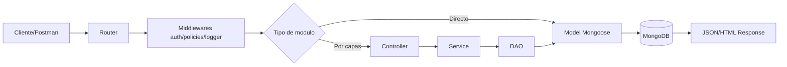
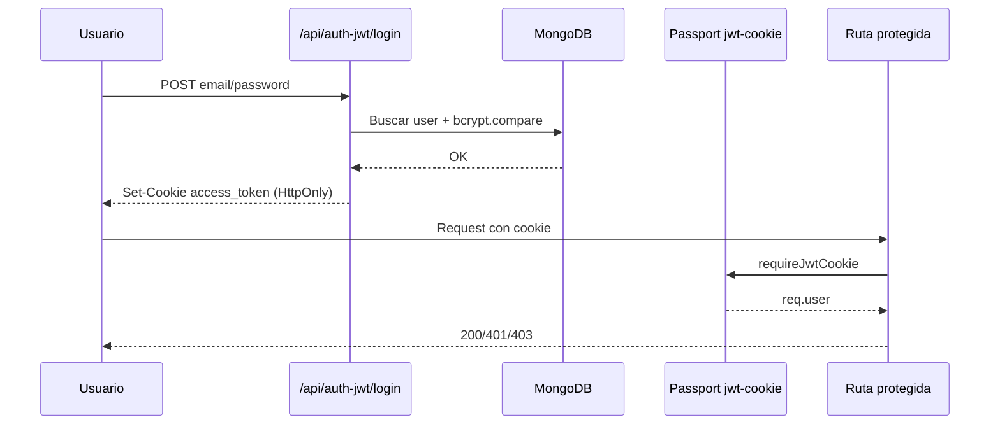

# Backend 77080

API backend en `Node.js + Express + MongoDB` con múltiples estrategias de autenticación, rutas versionadas, vistas con Handlebars y módulos de mensajería (Twilio) y mail (SMTP).

## Estado actual de la app

Módulos activos hoy:

- `home` (`GET /`)
- `students` clásico (`/student`)
- `students` por capas con JWT cookie (`/new-student`)
- auth por sesión (`/auth/*`)
- auth con Passport Local + Session + JWT Bearer (`/api/auth/*`)
- auth JWT en cookie HttpOnly (`/api/auth-jwt/*`)
- `orders` API + vista Handlebars (`/api/orders*`, `/orders`)
- `messaging` con Twilio (`/api/messaging/*`)
- `mailer` con Nodemailer + templates Handlebars (`/api/mail/*`)
- `advanced` con `CustomRouter` (`/advanced/*`)
- `process` para diagnóstico (`/process*`)
- API versionada (`/api/v1/*`)

## Stack técnico

- Node.js (ESM)
- Express `5.2.1`
- Mongoose `9.1.2`
- `express-session` + `connect-mongo`
- `passport` (`local`, `jwt-cookie`; `github` endpoint expuesto)
- `jsonwebtoken`
- `bcrypt`
- `express-handlebars`
- `twilio`
- `nodemailer`

## Arquitectura

Conviven dos estilos:

- Estilo directo: `Router -> Model` (por ejemplo `/student`).
- Estilo por capas: `Router -> Controller -> Service -> DAO -> Model` (por ejemplo `orders`).
- Variante por capas sin DAO: `Router -> Controller -> Service -> Model + DTO` (`/new-student`).



## Flujo JWT Cookie (actual)



## Mapa de routers

```mermaid
flowchart TD
    ROOT["app.use(...) en initRouters"] --> H["/ -> home.router"]
    ROOT --> ST["/student -> student.router"]
    ROOT --> AU["/auth -> user.router"]
    ROOT --> PR["/auth/me -> profile.router"]
    ROOT --> APIA["/api/auth -> auth.router"]
    ROOT --> APIJ["/api/auth-jwt -> jwt.router"]
    ROOT --> APIV1["/api/v1 -> api.v1.router"]
    ROOT --> ADV["/advanced -> advanced.router"]
    ROOT --> PROC["/process -> process.router"]
    ROOT --> NST["/new-student -> new.student.router"]
    ROOT --> ORD["/ -> order.router"]
    ROOT --> MSG["/ -> messaging.router"]
    ROOT --> MAIL["/ -> mailer.router"]
```



## Estructura del proyecto

```text
BE_2_77080/
|-- app.js
|-- package.json
|-- .env.example
|-- README.md
`-- src/
    |-- config/
    |   |-- auth/passport.config.js
    |   |-- db/connect.config.js
    |   `-- env/env.config.js
    |-- controllers/
    |   |-- student.controller.js
    |   |-- order.controller.js
    |   |-- messaging.controller.js
    |   `-- mailer.controller.js
    |-- dao/
    |   |-- base.dao.js
    |   `-- order.mongo.dao.js
    |-- middleware/
    |   |-- auth.middleware.js
    |   |-- polices.middleware.js
    |   `-- logger.middleware.js
    |-- models/
    |   |-- student.model.js
    |   |-- user.model.js
    |   |-- order.model.js
    |   `-- dto/student.dto.js
    |-- router/
    |   |-- router.js
    |   |-- custom/CustomRouter.js
    |   `-- routes/*.router.js
    |-- services/
    |   |-- student.service.js
    |   |-- order.service.js
    |   |-- messaging.service.js
    |   `-- mailer.service.js
    |-- server/
    |   |-- server.app.js
    |   `-- hbs.helper.js
    |-- views/
    |   |-- layouts/main.handlebars
    |   |-- orders/index.handlebars
    |   `-- emails/*.handlebars
    `-- postman/*.postman_collection.json
```

## Instalación y ejecución

```bash
npm install
npm run dev
```

Scripts:

- `npm run dev` -> nodemon
- `npm start` -> node app.js
- `npm test` -> placeholder

## Variables de entorno

Crear `.env` desde `.env.example`:

```powershell
Copy-Item .env.example .env
```

Variables usadas por la app:

| Variable | Requerida | Uso |
|---|---|---|
| `NODE_ENV` | No | Entorno de ejecución |
| `PORT` | No | Puerto (`5000` por default en código) |
| `MONGO_TARGET` | No | `LOCAL` o `ATLAS` |
| `MONGO_URL` | Sí si `MONGO_TARGET=LOCAL` | Conexión Mongo local |
| `MONGO_ATLAS_URL` | Sí si `MONGO_TARGET=ATLAS` | Conexión Mongo Atlas |
| `SECRET_SESSION` | Sí | `express-session` + firmado de cookie |
| `JWT_SECRET` | Sí | Firma/verificación JWT |
| `GITHUB_CLIENT_ID` | Opcional | OAuth GitHub (si se habilita strategy) |
| `GITHUB_CLIENT_SECRET` | Opcional | OAuth GitHub (si se habilita strategy) |
| `GITHUB_CALLBACK_URL` | Opcional | Callback GitHub |
| `TWILIO_ACCOUNT_SID` | Opcional | Cliente Twilio |
| `TWILIO_AUTH_TOKEN` | Opcional | Cliente Twilio |
| `TWILIO_FROM_SMS` | Opcional | Remitente SMS |
| `TWILIO_FROM_WAPP` | Opcional | Remitente WhatsApp |
| `SMTP_HOST` | Opcional | Host SMTP |
| `SMTP_PORT` | Opcional | Puerto SMTP |
| `SMTP_SECURE` | Opcional | `true/false` |
| `SMTP_USER` | Opcional | Usuario SMTP |
| `SMTP_PASS` | Opcional | Password SMTP |
| `SMTP_FROM` | Opcional | From de emails |

## Endpoints (métodos actuales)

### Home

- `GET /`

### Students clásico (`/student`)

- `GET /student`
- `POST /student`
- `GET /student/:id`
- `PUT /student/:id`
- `DELETE /student/:id`

### Auth de sesión (`/auth`)

- `POST /auth/register`
- `POST /auth/login`
- `POST /auth/logout`
- `GET /auth` (requiere sesión)
- `GET /auth/me` (requiere sesión; viene de `profile.router`)

### Auth Passport + Session + JWT Bearer (`/api/auth`)

- `POST /api/auth/register`
- `POST /api/auth/login`
- `POST /api/auth/logout`
- `GET /api/auth/me`
- `GET /api/auth/github`
- `GET /api/auth/github/callback`
- `GET /api/auth/github/fail`
- `POST /api/auth/jwt/login`
- `GET /api/auth/jwt/me` (Bearer token)

### Auth JWT cookie (`/api/auth-jwt`)

- `POST /api/auth-jwt/register`
- `POST /api/auth-jwt/login`
- `GET /api/auth-jwt/me` (cookie `access_token`, roles `user|admin`)
- `POST /api/auth-jwt/logout`

### Students por capas (`/new-student`)

- `GET /new-student/`
- `GET /new-student/:id` (`admin|user`)
- `POST /new-student/` (`admin`)
- `PUT /new-student/:id` (`admin`)
- `DELETE /new-student/:id` (`admin`)

### Orders (`/orders` y `/api/orders`)

- `GET /orders` (vista HTML Handlebars)
- `GET /api/orders`
- `GET /api/orders/:id`
- `GET /api/orders/:code`
- `POST /api/orders/`
- `PUT /api/orders/:id`
- `DELETE /api/orders/:id`
- `POST /api/orders/seed`

### Messaging (Twilio)

- `POST /api/messaging/sms`
- `POST /api/messaging/whatsapp`

### Mailer (SMTP + templates)

- `POST /api/mail/welcome`
- `POST /api/mail/order-status`

### Advanced (`/advanced`)

- `GET /advanced/students/:id`
- `GET /advanced/students/:id/courses`
- `GET /advanced/v1/ping`
- `GET /advanced/boom`

### Process (`/process`)

- `GET /process`
- `GET /process/info`

### API versionada (`/api/v1`)

Subrouter que expone:

- `GET /api/v1/`
- `GET|POST|PUT|DELETE /api/v1/student...`
- `POST|GET /api/v1/api/auth...`

## Rutas de frontend (vistas)

Rutas navegables en navegador para ver UI de la app:

- `GET /orders` -> renderiza `views/orders/index.handlebars` con layout `views/layouts/main.handlebars`.

Query params soportados en la vista de órdenes:

- `page` (default `1`)
- `limit` (default `10`)
- `status` (`pending`, `paid`, `delivered`, `cancelled`)

Ejemplos:

- `/orders`
- `/orders?page=2&limit=5`
- `/orders?status=paid`

Nota:

- Actualmente no hay más rutas HTTP que rendericen HTML; el resto de endpoints responde JSON.

## Ejemplos de payload

Crear SMS:

```json
{
  "to": "+54911XXXXXXXX",
  "body": "Hola, este es un mensaje de prueba"
}
```

Login JWT cookie:

```json
{
  "email": "johnny@example.com",
  "password": "password123"
}
```

Crear orden:

```json
{
  "code": "A-1003",
  "buyerName": "Mario Gomez",
  "buyerEmail": "mario@mail.com",
  "items": [
    { "title": "Teclado", "qty": 1, "unitPrice": 15000 },
    { "title": "Mouse", "qty": 2, "unitPrice": 8000 }
  ],
  "status": "pending"
}
```

## Notas de comportamiento actual

- En `order.router.js` las rutas con `polices(...)` requieren `req.user`, pero `router.use(requireJwtCookie)` está comentado; esto puede dar `401` en esas rutas.
- Hay colisión potencial entre `GET /api/orders/:id` y `GET /api/orders/:code` porque comparten patrón.
- En `passport.config.js` la strategy GitHub está comentada; los endpoints existen, pero requieren habilitar esa strategy para funcionar.

## Postman

Colecciones disponibles en `src/postman/`:

- `Auth.postman_collection.json`
- `Session Auth.postman_collection.json`
- `JWT Auth.postman_collection.json`
- `Students.postman_collection.json`
- `Advanced.postman_collection.json`
- `Process.postman_collection.json`

## Licencia

[MIT](./LICENCE)
